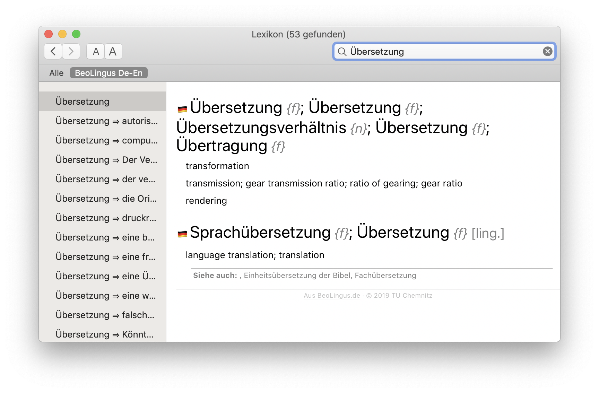

🇩🇪 [Deutsche Liesmich-Datei](LIESMICH.md)

BeoLingus German-English Dictionary Plugin
------------------------------------------

_Version: 2023.12.28 - OS X 10.11 to macOS 14_  
_Copyright © 2023 Wolfgang Kreutz and TU Chemnitz_

This plugin extends Apple's Dictionary Application with a German-English dictionary.

The content of this plugin is based on the online dictionary [www.beolingus.de](https://www.beolingus.de) by TU Chemnitz.

The Python script to convert the BeoLingus dictionary into a dictionary plugin was developed by Wolfgang Kreutz.

**Website with further information:** [www.tekl.de](https://tekl.de).  
**Support and source code:** [github.com/Tekl/beolingus-deutsch-englisch](https://github.com/Tekl/beolingus-deutsch-englisch)  
**Changelog:** [CHANGELOG.md](https://github.com/Tekl/beolingus-deutsch-englisch/blob/master/CHANGELOG.md)  
**Donation:** [PayPal](https://www.paypal.me/WolfgangReszel)

### Download

- [BeoLingus_Deutsch-Englisch.dmg](https://github.com/Tekl/beolingus-deutsch-englisch/releases/latest/download/BeoLingus_Deutsch-Englisch.dmg) (disk image containing an installer package)
- [BeoLingus Deutsch-Englisch.dictionary](https://github.com/Tekl/beolingus-deutsch-englisch/releases/latest/download/BeoLingus_Deutsch-Englisch_dictionaryfile.zip) (the plain Dictionary plugin bundle in a ZIP file for manual installation)

### Installation

#### Using the installer

1. Download the current Version of the dictionary plugin:  [BeoLingus_Deutsch-Englisch.dmg](https://github.com/Tekl/beolingus-deutsch-englisch/releases/latest/download/BeoLingus_Deutsch-Englisch.dmg)
2. Open the disk image and start the Installer “BeoLingus Deutsch-Englisch Installation”. Follow its instructions.
3. To install the plugin for the current user and not for all users, click on “Change Install Location …” in the installer and select “Install for me only”.

#### Manual installation

1. Download the plain dictionary file:  [BeoLingus Deutsch-Englisch.dictionary](https://github.com/Tekl/beolingus-deutsch-englisch/releases/latest/download/BeoLingus_Deutsch-Englisch_dictionaryfile.zip)
2. Launch the program “Dictionary.app” und execute the command “Open dictionary folder” from the File menu.  

1. The Finder will open a window with the folder “Dictionaries”. Drag and drop the downloaded plugin into this Finder window.  

2. Quit and restart the Dictionary-App, so it will se the newly installed plugin. Open the Preferences of Dictionary.app (⌘+Comma), scroll to the entry “OpenThesaurus Deutsch” and click the checkbox.  

### Uninstalling

You can also manually delete the plugin from the folder `/Library/Dictionaries` or `~/Library/Dictionaries` and restart the Dictionary.app.

### Build the dictionary by yourself using the source code

#### Requirements

- [Xcode](https://apps.apple.com/de/app/xcode/id497799835?mt=12)
- [Dictionary Development Kit as part of Additional Tools](https://developer.apple.com/download/all/?q=Additional%20Tools) (free Developer Account necessary)
- The DDK must be installed at the following Paths:
  - `/Developer/Auxiliary Tools/Dictionary Development Kit`
  - `/Developer/Utilities/Dictionary Development Kit`
  - `/Applications/Auxiliary Tools/Dictionary Development Kit`
  - `/Applications/Additional Tools/Utilities/Dictionary Development Kit`
  - `/DevTools/Utilities/Dictionary Development Kit`
  - `/Applications/Utilities/Dictionary Development Kit`
- Install the Xcode Command Line Tools with: `
 xcode-select --install`
- *Optional:* To generate the Installer, you have to install the free tool [Packages](http://s.sudre.free.fr/Software/Packages/about.html)
- *Optional:* To generate the Disk Image, you need [DMG Canvas](https://www.araelium.com/dmgcanvas) (20 US-$).

#### Start building with Terminal

- open Terminal.app
- Use `cd` to go into the folder `beolingus-deutsch-englisch-master`.
- Start building with `make. This will download the current word list from tu-chemnitz.de, converts it to XML, and uses the DDK to build the Dictionary plugin. The version number is generated by using the current date with the suffix **-beta**.
- The conversion takes several hours.
- If the Terminal returns to the prompt, you can install the plugin with `sudo make install`. This is also necessary when you want to create the Installer. It expects the plugin at /Library/Dictionaries.
- After installation, the Dictionary App will be opened automatically, so you can activate and test it.
- The make command accepts the following additional targets:
  - `make release`builds the plugin without the suffix “-beta” in the version number.
  - `make dmg`creates an Installer from the already installed **Beta**-plugin and generates a Disk Image (note the requirements). The Makefile uses my developer certificate, which you have to replace in the line with `packagesbuild`. The finished Disk Images is put into the folder `releases`.
  - `make releasedmg`creates an Installer from the installed plugin without the beta-suffix and generates a Disk Image (note the requirements). The Makefile uses my developer certificate, which you have to replace in the line with `packagesbuild`. The finished Disk Images is put into the folder `releases`.
  - `make notarize`sends the Disk Image from the current date folder inside `releases`to Apple for notarization. Here you also have to edit the Makefile and enter your developer account at `xcrun altool`behind `--username`. The password is fetched from the Keychain entry `AC_PASSWORD`.
  - `make nhistory`shows the notarization status. In most cases, it's better to wait for the confirmation Mail from Apple. 
  - After successful notarization, `make nstaple`applies the ticket to the Disk Image. Correctly notarized, it's ready for publishing.

### Licenses

- The word list from BeoLingus is licensed under [GPLv2](https://www.gnu.org/licenses/old-licenses/gpl-2.0.txt)

- This plugin and the build scripts are licenssed under [GPLv3](https://www.gnu.org/licenses/gpl.html)  

  This program is free software: you can redistribute it and/or modify it under the terms of the GNU General Public License as published by the Free Software Foundation, either version 3 of the License, or (at your option) any later version.  
  
  This program is distributed in the hope that it will be useful, but WITHOUT ANY WARRANTY; without even the implied warranty of MERCHANTABILITY or FITNESS FOR A PARTICULAR PURPOSE.  See the GNU General Public License for more details.  
  
  You should have received a copy of the [GNU General Public License](LICENSE) along with this program. If not, see https://www.gnu.org/licenses/.

  
