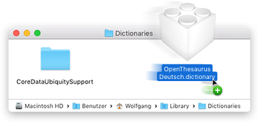
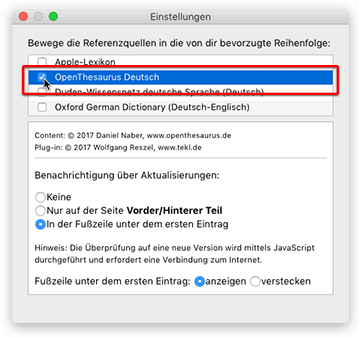

🇩🇪 [Deutsche Liesmich-Datei](LIESMICH.md)

BeoLingus German-English Dictionary Plugin
------------------------------------------

_Version: 2020.05.09 - Mac OS X 10.6 to macOS 10.14_ 
_Copyright © 2020 Wolfgang Reszel and TU Chemnitz_

This plugin extends Apple's Dictionary Application with a German-English dictionary.

The content of this plugin is based on the online dictionary [www.beolingus.de](https://www.beolingus.de) by TU Chemnitz.

The Python script to convert the BeoLingus dictionary into a dictionary plugin was developed by Wolfgang Reszel.

**Website with further informations:** [www.tekl.de](https://www.tekl.de). 
**Support and source code:** [github.com/Tekl/beolingus-deutsch-englisch](https://github.com/Tekl/beolingus-deutsch-englisch) 
**Changelog:** [CHANGELOG.md](https://github.com/Tekl/beolingus-deutsch-englisch/blob/master/CHANGELOG.md) 
**Donation:** [PayPal](https://www.paypal.me/WolfgangReszel)

### Download

- [BeoLingus_Deutsch-Englisch.dmg](https://github.com/Tekl/beolingus-deutsch-englisch/releases/latest/download/BeoLingus_Deutsch-Englisch.dmg) (disk image containing an installer package)
- [BeoLingus Deutsch-Englisch.dictionary](https://github.com/Tekl/beolingus-deutsch-englisch/releases/latest/download/BeoLingus_Deutsch-Englisch_dictionaryfile.zip) (the plain Dictionary plugin bundle in a ZIP file for manual installation)

### Installation

#### Using the installer

1. Download the current Version of the dictionary plugin: [BeoLingus_Deutsch-Englisch.dmg](https://github.com/Tekl/beolingus-deutsch-englisch/releases/latest/download/BeoLingus_Deutsch-Englisch.dmg)
2. Open the disk image and start the Installer “BeoLingus Deutsch-Englisch Installation”. Follow its instructions.
3. To install the plugin for the current user and not for all users, click on “Change Install Location …” in the installer and select “Install for me only”.

#### Manual installation for Mac OS X 10.7 or newer

1. Download the plain dictionary file: [BeoLingus Deutsch-Englisch.dictionary](https://github.com/Tekl/beolingus-deutsch-englisch/releases/latest/download/BeoLingus_Deutsch-Englisch_dictionaryfile.zip)
2. Launch the program “Dictionary.app” und execute the command “Open dictionary folder” from the File menu.  

1. The Finder will open a window with the folder “Dictionaries”. Drag and drop the downloaded plugin into this Finder window.  

2. Quit and restart the Dictionary-App, so it will se the newly installed plugin. Open the Preferences of Dictionary.app (⌘+Comma), scroll to the entry “OpenThesaurus Deutsch” and click the checkbox.  

#### Manual installation for Mac OS X 10.6

1. Download the plain dictionary file: [BeoLingus Deutsch-Englisch.dictionary](https://github.com/Tekl/beolingus-deutsch-englisch/raw/master/objects/Dictionaries/BeoLingus Deutsch-Englisch.dictionary)
2. Copy the downloaded plugin into the folder `/Library/Dictionaries` (for all users) or `~/Library/Dictionaries` (for current user). Maybe you have to create the folder first.
3. Quit and restart the Dictionary-App, so it will se the newly installed plugin. Open the Preferences of Dictionary.app (⌘+Comma), scroll to the entry “OpenThesaurus Deutsch” and click the checkbox.
4. It could be necessary to re-login/restart or to quit the process “DictionaryPanel” in the Activity Monitor, so the plugin can be used in the dictionary panel (⌃⌘D).

### Uninstalling

You can also manually delete the plugin from the folder `/Library/Dictionaries` or `~/Library/Dictionaries` and restart the Dictionary.app.

Licenses
--------

- The word list from BeoLingus is licensed under [GPLv2](https://www.gnu.org/licenses/old-licenses/gpl-2.0.txt)

- This plugin and the build scripts are licenssed under [GPLv3](https://www.gnu.org/licenses/gpl.html)  This program is free software: you can redistribute it and/or modify it under the terms of the GNU General Public License as published by the Free Software Foundation, either version 3 of the License, or (at your option) any later version.  This program is distributed in the hope that it will be useful, but WITHOUT ANY WARRANTY; without even the implied warranty of MERCHANTABILITY or FITNESS FOR A PARTICULAR PURPOSE.  See the GNU General Public License for more details.  You should have received a copy of the [GNU General Public License](LICENSE) along with this program. If not, see <https://www.gnu.org/licenses/>.

  
